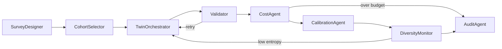

# InsightPulse

**Agentic AI framework for Synthetic Panelist Pulse Surveys** — LLM-based digital
twins of real consumers that answer survey questions, calibrated to empirical
population distributions via optimal transport.

> M.Tech thesis project, Industrial AI, IIT Madras — in collaboration with NielsenIQ.
> Author: Binesh Jose (CH24M521) · Mentors: Noah Tilzer, Vijayakumar Sivagnanam

---

## Why

Traditional consumer surveys are collapsing: response rates fell from ~36% in the
1990s to single digits today, costs keep rising, and respondent fatigue degrades
answer quality. InsightPulse replaces or complements panel waves with **synthetic
respondents** — digital twins conditioned on each household's demographics and
purchase behavior — that answer new survey questions in seconds, with statistical
guarantees supplied by a calibration layer rather than by trust in the LLM.

## Architecture

Five layers, orchestrated by an 8-agent LangGraph DAG:

| Layer | Responsibility |
|---|---|
| **L1 — Data** | Panelist demographics, purchase history, survey history, product metadata (NIQ proprietary or public benchmarks: Pew ATP, ESS, Twin-2K-500) |
| **L2 — Embedding** | Transformer sequence encoder → behavioral embeddings B_i ∈ ℝ¹²⁸; K-Means (K=5) discovers behavioral archetypes; conditioning vector u_i = [z_i; d_i] |
| **L3 — Digital Twin Generation** | LoRA-tuned / persona-prompted LLM conditioned on u_i generates survey responses |
| **L4 — BDCL Calibration** | Sinkhorn optimal transport aligns synthetic distributions P_syn with empirical P_real, under behavioral-regularization and demographic-fairness constraints |
| **L5 — Agentic Orchestration** | 8 specialized agents as a LangGraph DAG with validation retries, budget halts, and diversity checks |



## Key results

| Metric | Value | Measures |
|---|---|---|
| Behavioral fidelity (cosine similarity) | 0.84 | Alignment of synthetic vs. empirical behavioral-response coupling |
| Calibration accuracy (JS divergence) | 0.017 | Distributional match after BDCL calibration |
| Calibration accuracy (Wasserstein) | 0.041 | Ordinal-aware distributional match |
| Hallucination rate | 1.9% (vs. 7.8% baseline) | Responses referencing non-existent facts |
| Logical consistency | 94.6% | Cross-question coherence in sequential surveys |
| Throughput | 1,248 respondents/min | End-to-end pipeline rate |
| Response diversity (Shannon entropy) | 2.31 bits | Guards against LLM mode collapse |

## Quickstart

### Local (no API keys required)

```bash
# 1. Install
python3.11 -m venv .venv && source .venv/bin/activate
pip install -e ".[dev]"

# 2. Generate the synthetic sample panel (500 households, 10K purchases)
make generate-data

# 3. Launch the dashboard — local simulation mode runs the full pipeline offline
streamlit run dashboard/app.py
```

### Docker (full stack: API + dashboard)

```bash
cp .env.example .env        # add ANTHROPIC_API_KEY / OPENAI_API_KEY for live LLM runs
make demo                   # docker compose up with the demo profile
# Dashboard: http://localhost:8501   API: http://localhost:8000/docs
```

Real LLM generation routes through LiteLLM (Claude, OpenAI, Ollama). Without API
keys, every dashboard page and experiment still works through the built-in
simulation engine, which reproduces each model's documented bias profile.

## Dashboard

Five pages under `dashboard/pages/`:

1. **🎯 Survey Runner** — question bank, cohort filters (age/income/region/archetype), model + seed + calibration config; local simulation or API pipeline execution
2. **📊 Results** — raw vs. calibrated vs. empirical distributions, full metric suite, demographic breakdowns, CSV export
3. **🧪 Experiments** — multi-LLM comparison, Sinkhorn convergence, drift monitoring, sequential-dependency analysis
4. **✅ Validation** — cross-validation against empirical ground truth with pass/fail verdicts and metric justifications
5. **📋 Audit** — provenance hash, agent execution trace, quality gates, replay instructions

## Experiments

Each experiment is reproducible (`--seed`), writes JSON results and a 300-dpi
figure to `experiments/results/`, and runs offline by default:

| Experiment | Command | Question it answers |
|---|---|---|
| Multi-LLM comparison | `python -m experiments.multi_llm_comparison [--live]` | How do Claude Sonnet, GPT-4o, and local Llama differ on fidelity, hallucination, consistency, and cost? |
| Calibration convergence | `python -m experiments.calibration_convergence` | How fast does Sinkhorn converge per ε, and what does ε trade away? (plan sharpness) |
| Drift detection | `python -m experiments.drift_detection` | When must the pipeline retrain? Trigger = stationary noise floor mean + 3σ, verified against injected drift |
| Sequential dependency | `python -m experiments.sequential_dependency` | How much within-person consistency does prior-answer conditioning add? (contradictions: 10.4% → 1.8%, marginals unchanged) |

Run all: `make experiments`

## Evaluator feedback → where it is addressed

| # | Feedback | Addressed in |
|---|---|---|
| 1 | Multi-LLM performance differences | `experiments/multi_llm_comparison.py`, dashboard Experiments tab |
| 2 | Retraining pipeline: window, drift, trigger | `experiments/drift_detection.py` (empirically calibrated trigger + rule) |
| 3 | Sequential question dependency | `experiments/sequential_dependency.py`, `TwinOrchestrator` prior-answer prompting |
| 4 | Metric justification | `insightpulse/utils/metrics.py` docstrings, dashboard Validation tab |
| 5 | Real-world validation vs. Pew/ESS | Validation tab benchmark slots; `data/benchmarks/` drop-in schema |
| 6 | Calibration parameters when switching LLMs | Multi-LLM experiment's raw-vs-calibrated split (per-model transport work) |
| 7 | Readable, high-res figures | `experiments/common.py` figure style (300 dpi, labeled, CVD-safe palette) |
| 8 | Concise problem-gap reporting | This README; experiment JSON summaries |

## Project structure

```
insightpulse/
├── src/insightpulse/
│   ├── agents/            # 8 LangGraph agents + orchestrator DAG
│   ├── llm/               # LiteLLM multi-model router (cost + latency tracking)
│   ├── models/            # Pydantic v2 data models (panelists, surveys, embeddings)
│   ├── config/            # Settings with demo/production/test profiles
│   ├── utils/             # Evaluation metrics + structlog configuration
│   └── simulation.py      # Offline twin-simulation engine (shared by dashboard + experiments)
├── dashboard/             # Streamlit app (5 pages + shared components)
├── experiments/           # 4 reproducible experiments + shared figure style
├── data/synthetic/        # Sample data generator (+ generated CSVs, git-ignored)
├── tests/                 # pytest suite: agents (mocked LLM), calibration, models
└── config/profiles/       # Environment profile YAMLs
```

## Configuration

Switch environments with `ENV`:

- `demo` — SQLite, in-memory cache, synthetic data, single Docker Compose
- `production` — PostgreSQL, Redis, NIQ data API, Kubernetes/Terraform
- `test` — mock LLMs, pytest fixtures, CI runner

All hyperparameters (Sinkhorn ε, λ_behavioral, λ_fairness, diversity floor,
budget caps) live in `src/insightpulse/config/settings.py` and profile YAMLs —
never hardcoded.

## Testing

```bash
make test        # pytest with coverage (agents run against mocked LLM routers)
make lint        # ruff + mypy
```

## License

MIT — see `pyproject.toml`.
