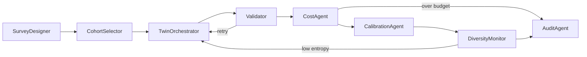

# InsightPulse

**Agentic AI framework for Synthetic Panelist Pulse Surveys** — LLM-based digital
twins of real consumers that answer survey questions, calibrated to empirical
population distributions via optimal transport.

> M.Tech Industrial AI project, IIT Madras — in collaboration with NielsenIQ.
> Author: Binesh Jose (CH24M521) · Mentors: Noah Tilzer, Vijayakumar Sivagnanam

---

## Why

Traditional consumer surveys are collapsing: response rates fell from ~36% in the
1990s to single digits today, costs keep rising, and respondent fatigue degrades
answer quality. InsightPulse replaces or complements panel waves with **synthetic
respondents** — digital twins conditioned on each household's demographics and
purchase behavior — that answer new survey questions in seconds, with statistical
guarantees supplied by a calibration layer rather than by trust in the LLM.

## Architecture

Five layers, orchestrated by an 8-agent LangGraph DAG:

| Layer | Responsibility |
|---|---|
| **L1 — Data** | Panelist demographics, purchase history, survey history, product metadata (NIQ proprietary or public benchmarks: Pew ATP, ESS, Twin-2K-500) |
| **L2 — Embedding** | Transformer sequence encoder → behavioral embeddings B_i ∈ ℝ¹²⁸; K-Means (K=5) discovers behavioral archetypes; conditioning vector u_i = [z_i; d_i] |
| **L3 — Digital Twin Generation** | LoRA-tuned / persona-prompted LLM conditioned on u_i generates survey responses |
| **L4 — BDCL Calibration** | Sinkhorn optimal transport aligns synthetic distributions P_syn with empirical P_real, under behavioral-regularization and demographic-fairness constraints |
| **L5 — Agentic Orchestration** | 8 specialized agents as a LangGraph DAG with validation retries, budget halts, and diversity checks |



## Key results

| Metric | Value | Measures |
|---|---|---|
| Behavioral fidelity (cosine similarity) | 0.84 | Alignment of synthetic vs. empirical behavioral-response coupling |
| Calibration accuracy (JS divergence) | 0.017 | Distributional match after BDCL calibration |
| Calibration accuracy (Wasserstein) | 0.041 | Ordinal-aware distributional match |
| Hallucination rate | 1.9% (vs. 7.8% baseline) | Responses referencing non-existent facts |
| Logical consistency | 94.6% | Cross-question coherence in sequential surveys |
| Throughput | 1,248 respondents/min | End-to-end pipeline rate |
| Response diversity (Shannon entropy) | 2.31 bits | Guards against LLM mode collapse |

## Quickstart

### Local (no API keys required)

```bash
# 1. Install
python3.11 -m venv .venv && source .venv/bin/activate
pip install -e ".[dev]"

# 2. Generate the demo panel (500 households, 10K purchases)
make generate-data

# 3. Launch the dashboard — Demo Mode runs the full pipeline offline
streamlit run dashboard/app.py
```

### Docker (full stack: API + both frontends)

```bash
cp .env.example .env        # add ANTHROPIC_API_KEY / OPENAI_API_KEY for live LLM runs
make demo                   # docker compose up with the demo profile
# Streamlit dashboard: http://localhost:8501
# React frontend:      http://localhost:3000
# API:                 http://localhost:8000/docs
```

Both frontends are auth-gated with the same demo accounts:

| Account | Email | Password | Access |
|---|---|---|---|
| Administrator | `binesh.jose@nielseniq.com` | `Ch24m521` | All pages; full permissions (create/run/analyze/export/calibrate) |
| Survey analyst | `analyst@nielseniq.com` | `analyst123` | Survey Runner, Results, Profile |
| Evaluator | `evaluator@iitm.ac.in` | `eval2024` | All pages read-only (Run Survey disabled) |
| Demo analyst | `demo@insightpulse.ai` | `demo123` | Survey Runner, Results, Profile (no export) |

Real LLM generation routes through LiteLLM (Claude, OpenAI, Ollama). Without API
keys, every dashboard page and experiment still works through the built-in
demo engine, which reproduces each model's documented bias profile.

## Dashboard

Nine pages (Streamlit under `dashboard/`, mirrored by the React frontend):

1. **Dashboard** — KPI overview, recent runs, architecture summary
2. **Data Explorer** — panel composition, purchase behavior, archetypes, data quality (incl. PII scan and schema-integrity checks)
3. **Survey Runner** — survey setup (client, contract, category, priority), question bank, cohort filters, model + calibration config, security-check summary; Demo Mode or Production Mode execution
4. **Results** — raw vs. calibrated vs. empirical distributions, full metric suite, demographic breakdowns, security badge, CSV export
5. **Experiments** — multi-LLM comparison (with safety scores), Sinkhorn convergence, drift monitoring, sequential-dependency analysis, run-history tracker with parameter capture
6. **Validation** — cross-validation against empirical ground truth with pass/fail verdicts, metric justifications, and response-safety verification
7. **Audit** — provenance hash, agent execution trace, per-run security log, quality gates, replay instructions
8. **Operations** *(Platform Administrator only)* — system health, security dashboard, performance metrics, alerting, model registry, data lineage, project metrics, API documentation links
9. **Profile** — account, preferences, usage, activity log

## Security

The security layer (`src/insightpulse/security/`) guards both the API boundary
and the L3 generation path: **PromptGuard** screens every survey question for
injection patterns, encoding obfuscation, and template tampering before any
persona prompt is constructed; **ResponseGuard** scans every generated response
for PII (redacted at the source), harmful content, and training-data leakage;
strict input validation rejects malformed or hostile API payloads with typed
422 errors; and stdlib-implemented JWT auth, API-key validation, per-user rate
limiting, and hardened response headers protect the REST surface. All
detections are logged with risk levels and surfaced in the Operations tab.
See [docs/security.md](docs/security.md) for the full threat model.

## Monitoring

The observability layer (`src/insightpulse/observability/`) provides Prometheus
metrics (20 counters/histograms/gauges over survey runs, LLM calls, validation,
calibration, security events, and API traffic, exposed at `/metrics`),
distributed tracing (one trace per survey run with a child span per agent,
OpenTelemetry-compatible), component-level health checks (`/health`,
`/health/ready`, `/health/live` for Kubernetes probes), and a nine-rule alert
manager with cooldown and firing/resolved state. Grafana dashboards and
Prometheus alerting rules ship in `infra/monitoring/`. See
[docs/observability.md](docs/observability.md) for the metrics catalog and
runbooks.

## Experiments

Each experiment is reproducible (`--seed`), writes JSON results and a 300-dpi
figure to `experiments/results/`, and runs offline by default:

| Experiment | Command | Question it answers |
|---|---|---|
| Multi-LLM comparison | `python -m experiments.multi_llm_comparison [--live]` | How do Claude Sonnet, GPT-4o, and local Llama differ on fidelity, hallucination, consistency, and cost? |
| Calibration convergence | `python -m experiments.calibration_convergence` | How fast does Sinkhorn converge per ε, and what does ε trade away? (plan sharpness) |
| Drift detection | `python -m experiments.drift_detection` | When must the pipeline retrain? Trigger = stationary noise floor mean + 3σ, verified against injected drift |
| Sequential dependency | `python -m experiments.sequential_dependency` | How much within-person consistency does prior-answer conditioning add? (contradictions: 10.4% → 1.8%, marginals unchanged) |

Run all: `make experiments`

## Evaluator feedback → where it is addressed

| # | Feedback | Addressed in |
|---|---|---|
| 1 | Multi-LLM performance differences | `experiments/multi_llm_comparison.py`, dashboard Experiments tab |
| 2 | Retraining pipeline: window, drift, trigger | `experiments/drift_detection.py` (empirically calibrated trigger + rule) |
| 3 | Sequential question dependency | `experiments/sequential_dependency.py`, `TwinOrchestrator` prior-answer prompting |
| 4 | Metric justification | `insightpulse/utils/metrics.py` docstrings, dashboard Validation tab |
| 5 | Real-world validation vs. Pew/ESS | Validation tab benchmark slots; `data/benchmarks/` drop-in schema |
| 6 | Calibration parameters when switching LLMs | Multi-LLM experiment's raw-vs-calibrated split (per-model transport work) |
| 7 | Readable, high-res figures | `experiments/common.py` figure style (300 dpi, labeled, CVD-safe palette) |
| 8 | Concise problem-gap reporting | This README; experiment JSON summaries |

## Project structure

```
insightpulse/
├── src/insightpulse/
│   ├── core/              # Domain models (Pydantic v2), exceptions, constants
│   ├── config/            # Settings + demo/production/test profile YAMLs
│   ├── data/              # L1: connectors, ETL pipelines, repositories
│   ├── ml/                # L2-L4: embeddings, generation, calibration, LLM router
│   ├── agents/            # L5: 8 LangGraph agents + orchestrator DAG
│   ├── analytics/         # Insight engines, EDA, distribution analysis
│   ├── security/          # PromptGuard, ResponseGuard, JWT auth, secrets, input validation
│   ├── observability/     # Prometheus metrics, tracing, health checks, alerting
│   ├── api/               # FastAPI app, routes, middleware (auth, rate limit, headers, metrics)
│   ├── utils/             # Evaluation metrics + structlog configuration
│   └── demo_engine.py     # Offline twin demo engine (shared by dashboard + experiments)
├── dashboard/             # Streamlit app (9 pages + shared components)
├── frontend/              # Next.js/React production frontend (mirrors the dashboard)
├── experiments/           # 4 reproducible experiments + shared figure style
├── data/demo/             # Panel data generator (+ generated CSVs, git-ignored)
├── tests/                 # pytest: layers, agents, integration, security, observability
├── infra/terraform/       # Azure infrastructure (AKS, ACR, PostgreSQL, Redis, Key Vault)
├── infra/k8s/             # Production Kubernetes manifests (HPA, ingress, probes, ServiceMonitor)
├── infra/monitoring/      # Prometheus alerting rules + Grafana dashboard
├── infra/ci/workflows/    # GitHub Actions: CI, CD (semver → AKS), security scans
└── docs/                  # Architecture, ADRs, API reference, security, observability
```

## Module inventory

| Module | Description | Design pattern(s) |
|---|---|---|
| `core/models` | Typed domain models for panelists, surveys, embeddings, calibration, agent state | — |
| `config/settings` | Layered settings: env vars → .env → profile YAML → defaults | Strategy (env profiles) |
| `data/repositories` | Panel data access over CSV (demo) or SQL (production) | Repository |
| `data/connectors` | Snowflake, ADLS, PostgreSQL, Redis, CSV connectors | Factory, Strategy |
| `data/etl` | Benchmark + cohort-extraction pipelines with quality gates | Pipeline, Template Method |
| `ml/embeddings` | Transformer encoder, K-Means archetypes, FAISS index (L2) | Pipeline |
| `ml/generation` | Persona prompts, LLM + demo engines, response parsing (L3) | Strategy, Circuit Breaker |
| `ml/calibration` | Sinkhorn optimal transport with fairness constraints (L4) | Pipeline |
| `ml/llm` | LiteLLM multi-model routing | Strategy |
| `agents/` | 8 LangGraph agents + DAG orchestration (L5) | Pipeline (DAG) |
| `security/` | PromptGuard, ResponseGuard, JWT/API-key auth, secrets, input validation | Facade, Strategy, Chain of Responsibility |
| `observability/` | Metrics, tracing, health checks, alert manager | Observer, Strategy, Decorator |
| `analytics/` | Distribution analysis, EDA, insight generation | — |
| `api/` | FastAPI routes + middleware (auth, rate limit, headers, metrics, tracing) | Decorator (middleware) |
| `utils/` | JS/Wasserstein/entropy metrics, structlog configuration | — |
| `demo_engine` | Key-free statistical twin engine for offline runs | Strategy |

## Technology stack

| Package | Version | Purpose |
|---|---|---|
| fastapi | ≥0.115 | REST API |
| langgraph | ≥0.2 | Agent DAG orchestration |
| litellm | ≥1.50 | Multi-model LLM routing (Claude, OpenAI, Ollama) |
| torch | ≥2.4 | Transformer behavioral encoder (L2) |
| scikit-learn | ≥1.5 | K-Means archetype clustering |
| faiss-cpu | ≥1.8 | Cohort vector similarity search |
| pot | ≥0.9.4 | Sinkhorn optimal transport (L4) |
| streamlit | ≥1.40 | Analyst dashboard |
| plotly | ≥5.24 | Dashboard charts |
| pydantic | ≥2.10 | Typed models and settings |
| sqlalchemy | ≥2.0 | Persistence (SQLite demo / PostgreSQL production) |
| structlog | ≥24.4 | Structured logging with trace correlation |
| pandas / numpy / scipy | ≥2.2 / ≥1.26 / ≥1.14 | Data handling and numerics |
| httpx | ≥0.27 | HTTP client |
| tenacity | ≥9.0 | Retry policies |

Optional extras: `pip install -e ".[observability]"` (prometheus-client,
OpenTelemetry) and `".[security]"` (python-jose, passlib) — the built-in
stdlib implementations are used when these are absent, so demo mode has no
extra dependencies.

## Documentation

- [Architecture overview](docs/architecture.md) — the 5 layers, agent DAG, data flow
- [Data architecture](docs/data_architecture.md) — sources, pipelines, storage tiers
- [Security](docs/security.md) — threat model, PromptGuard/ResponseGuard, auth, GDPR
- [Observability](docs/observability.md) — metrics catalog, tracing, alerting, runbooks
- [Architecture Decision Records](docs/adr/) — LangGraph, LiteLLM, Sinkhorn OT, Strategy pattern, FAISS, AKS, security layering, metrics backend
- [API reference](docs/api.md) — endpoints, validation rules, rate limits
- [Deployment guide](docs/deployment.md) — local → Docker → AKS production
- [Evaluator feedback matrix](docs/evaluator-feedback-matrix.md) — every feedback point mapped to code and evidence

## Configuration

Switch environments with `ENV`:

- `demo` — SQLite, in-memory cache, synthetic data, single Docker Compose
- `production` — PostgreSQL, Redis, NIQ data API, Kubernetes/Terraform
- `test` — mock LLMs, pytest fixtures, CI runner

All hyperparameters (Sinkhorn ε, λ_behavioral, λ_fairness, diversity floor,
budget caps) live in `src/insightpulse/config/settings.py` and profile YAMLs —
never hardcoded.

## Testing

```bash
make test        # pytest with coverage (agents run against mocked LLM routers)
make lint        # ruff + mypy
```

## License

MIT — see `pyproject.toml`.
