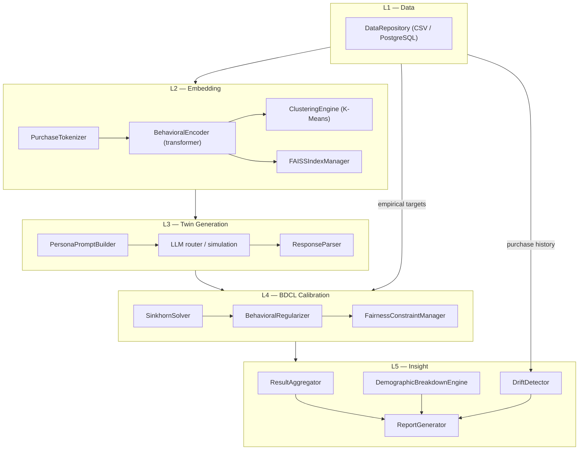
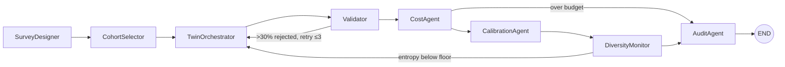
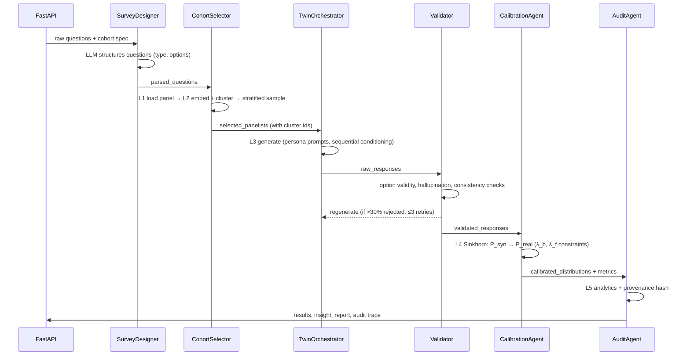

# InsightPulse — System Architecture

InsightPulse generates survey-grade synthetic consumer responses: LLM-based
digital twins of real panelists answer survey questions, and an optimal-
transport calibration layer aligns the resulting distributions with
empirical ground truth. This document describes the five architectural
layers, the agent orchestration on top of them, and the data flow through
a survey run.

## Layered architecture

Every layer is an abstract contract with two Strategy implementations —
a lightweight demo strategy (no external dependencies) and an industrial
production strategy — selected once, at the composition root
(`layers/__init__.py`), by the `ENV` profile. See
[ADR-004](adr/004-strategy-pattern-env-profiles.md).

| Layer | Contract | Demo strategy | Production strategy |
|---|---|---|---|
| **L1 Data** | `DataRepository` | `CSVRepository` (sample CSVs) | `SQLRepository` (PostgreSQL, pooled, retried, CSV fallback) |
| **L2 Embedding** | `EmbeddingEngine` | `PrecomputedEmbeddingEngine` (features + seeded projection) | `TransformerEmbeddingEngine` (tokenizer → transformer → K-Means → FAISS) |
| **L3 Generation** | `GenerationEngine` | `DemoGenerationEngine` (archetype-conditional statistics) | `LLMGenerationEngine` (concurrent, retried, circuit-broken LLM calls) |
| **L4 Calibration** | `CalibrationEngine` | `SimpleCalibrationEngine` (convex blend) | `SinkhornCalibrationEngine` (log-domain entropic OT) |
| **L5 Insight** | `InsightEngine` | `BasicInsightEngine` (aggregation) | `FullInsightEngine` (chi-square breakdowns, drift detection) |

## Agent orchestration (LangGraph DAG)

Eight agents coordinate a survey run as a directed acyclic graph with
conditional retry edges. Agents are deliberately **thin**: each one reads
pipeline state, delegates to a layer through its factory, and writes typed
state back. The DAG topology never changes between demo and production —
only the strategies behind the factories do.

State flows through a typed `SurveyPipelineState` (TypedDict) where every
field has one owning agent; the `agent_trace` channel uses an accumulating
reducer so the full execution history reaches the AuditAgent. See
[ADR-001](adr/001-langgraph-over-custom-dag.md).

## Data flow of one survey run

## Component responsibilities

- **`src/insightpulse/agents/`** — orchestration only: state contracts,
  retry decisions, tracing. No business logic.
- **`src/insightpulse/layers/`** — all business logic, one module per
  thesis layer, each independently unit-tested against both strategies.
- **`src/insightpulse/llm/`** — LiteLLM multi-model router with cost and
  latency accounting ([ADR-002](adr/002-litellm-multi-model-routing.md)).
- **`src/insightpulse/utils/metrics.py`** — the single implementation of
  every evaluation metric (JS, Wasserstein, entropy, hallucination rate);
  dashboard, agents, and experiments all report through it.
- **`src/insightpulse/demo_engine.py`** — the offline twin engine used
  by demo L3, the dashboard, and the experiments.
- **`experiments/`** — the four reproducible thesis experiments.
- **`dashboard/`** — Streamlit UI (5 pages) consuming the API or the
  demo engine directly.

## Cross-cutting concerns

| Concern | Mechanism |
|---|---|
| Configuration | `pydantic-settings` profiles (demo / production / test); every hyperparameter in `config/settings.py`, none hardcoded |
| Errors | `InsightPulseError` hierarchy, one subclass per layer; API translates to HTTP at the boundary |
| Logging | `structlog` with contextvar run-binding; console renderer in demo, JSON lines in production (scraped by Log Analytics) |
| Resilience | tenacity retries (L1, L3), circuit breaker (L3), graceful degradation (SQL→CSV fallback), DAG-level regeneration |
| Reproducibility | seeds threaded end-to-end; provenance hash over the request fingerprint; versioned prompt templates |
| Secrets | environment variables only, sourced from Azure Key Vault via the CSI driver in production |

## Deployment topology

Local demo runs from `docker compose` (SQLite + synthetic data, no keys
needed). Production runs on AKS behind an nginx Ingress, with PostgreSQL
Flexible Server, Azure Cache for Redis, and Key Vault — provisioned by
`terraform/`, deployed by `ci/workflows/cd.yml`, described in
[deployment.md](deployment.md) and [ADR-006](adr/006-aks-deployment.md).
