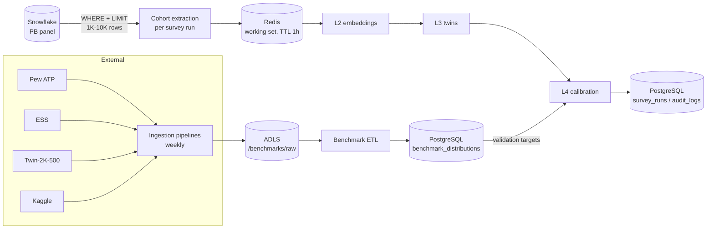

# Data Architecture

How data moves through InsightPulse in production, and how demo mode
mirrors it. The companion schema reference is
[`data/schemas/data_dictionary.yaml`](../data/schemas/data_dictionary.yaml).

## Source systems

| System | Scale | Role |
|---|---|---|
| **Snowflake** (`NIQ_PANEL.CPS`) | PB | NIQ panel: demographics, purchases, products, survey history — queried **in place** |
| **ADLS** (`insightpulse` container) | GB | Benchmark landing zone + versioned ML artifacts |
| **PostgreSQL** | MB | Application metadata only: runs, audits, experiments, benchmark distributions |
| **Redis** | MB | Hot cache for the current working set (TTL 1 hour) |
| External benchmark sources | — | Pew ATP, European Social Survey, Twin-2K-500, Kaggle |

## Flows

### 1. Benchmark ingestion (external → ADLS)

One pipeline per source (`insightpulse/data/etl/ingestion/`), all built on
the same Template Method base: discover → download (retried, checksummed)
→ validate format → convert to a standardized Parquet schema → land in
`/benchmarks/raw/{source}/…` with an `ingestion_manifest.json` recording
URL, date, size, version, row count, checksums, and schema. Cadence:
weekly refresh via the pipeline scheduler; each pipeline supports
`dry_run` for testing.

### 2. Benchmark ETL (ADLS → PostgreSQL)

`BenchmarkETLPipeline` reads the cleaned landings, harmonizes question
formats across sources, standardizes demographics to the NIQ schema, and
computes per-question response distributions per demographic group. The
quality gate enforces schema, zero nulls, no option above 80% share, and
sample-size floors before upserting into `benchmark_distributions` — the
exact rows the L4 validation compares synthetic output against.

### 3. Cohort extraction (Snowflake → Redis, per survey run)

The main production pipeline (`CohortExtractionPipeline`). For each run it
queries **only** the panelists matching the cohort filters plus their
purchase history — every query is parameterized and LIMIT-bounded to the
configured working-set cap — then standardizes demographics, dedupes,
scores RFM, gates on cohort size and integrity, and caches the frame in
Redis under `insightpulse:{run_id}:cohort`. Completion triggers L2
embedding computation over the cached cohort.

## Why the data stays where it is

**PB data stays in Snowflake.** Copying the panel anywhere would duplicate
petabytes, create a second governance surface, and turn every survey into
an ingestion project. Snowflake already provides the compute, access
control, and audit surface; the application's discipline is that *every*
query is a bounded working-set extract.

**PostgreSQL is app metadata only.** Runs, audit trails, experiment
results, and harmonized benchmark distributions are megabytes — the
right shape for a transactional store the app owns and migrates with
Alembic. Raw panel rows never land here by design.

**Redis is a cache, not a store.** Keys carry the run ID, expire after an
hour, and can always be regenerated from Snowflake — losing Redis loses
nothing but warm-up time.

## Caching strategy

| Layer | What | Key | TTL |
|---|---|---|---|
| Redis | cohort frame, embeddings, FAISS index, calibration weights | `insightpulse:{run_id}:{type}` | 1 h |
| ADLS | versioned embeddings + FAISS artifacts (training/serving share) | `/artifacts/{kind}/{version}` | permanent, versioned |
| In-process | demo CSV reads (TTL cache in the repository layer) | dataset name | 5 min |

## Governance and access control

- Snowflake access uses a read-only role (`INSIGHTPULSE_READER`) scoped to
  the four panel tables; the application holds no write grants.
- ADLS authenticates via `DefaultAzureCredential` (managed identity in
  AKS) — no storage keys in code or config.
- PostgreSQL credentials come from Key Vault via the CSI driver
  (see `infra/k8s/keyvault-csi.yaml`).
- All connector SQL is parameterized; identifiers are validated before
  interpolation (defense in depth on top of the read-only role).
- Every pipeline writes structured logs (rows per stage, quality outcomes)
  suitable for alerting, and each landing carries a manifest for lineage.

## Demo mode

`CSVConnector` implements the same `PanelDataConnector` contract over
`data/demo/*.csv` (500 households, 10K purchases, 2.5K responses, same
schemas). The connector factory swaps it in automatically when Snowflake
is not configured, so every pipeline, page, and experiment runs
end-to-end with zero external dependencies or API keys.
